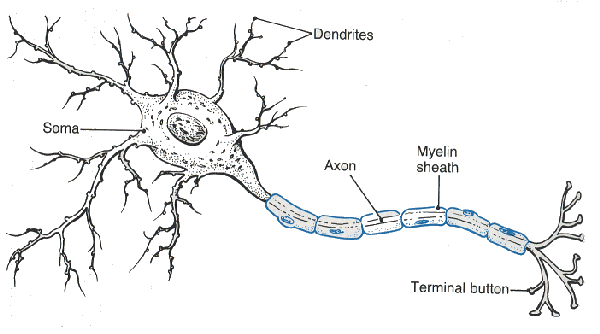
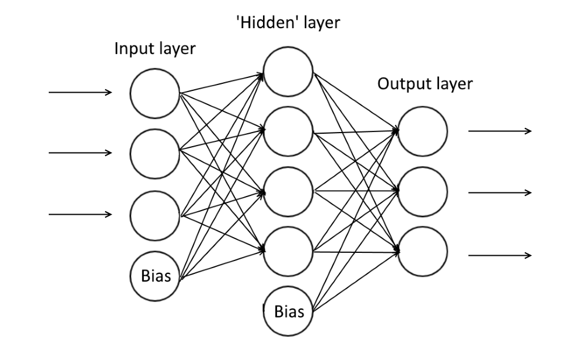

# Neural Networks

An article discussing how you can model a neuron, how realistic these models may be, and how these models can be used to simulate a neural network.

*Written by Ben Chiverton*

## The Neuron

Starting with the most basic element of the network - the neuron. It is the building block of a central nervous system, and is defined as *"a specialized cell transmitting nerve impulses"*. All this means is that a neuron receives signals, and also transmits signals. Where the neuron sends or receives a signal does not matter - for example, in the human body the signal received could be from photoreceptor cells (behind the retina, detecting light), thermoreceptor cells (detecting a change in temperature) or other neurons in the network, and said neuron could transmit a signal to anything from Myocytes (muscle cells, causing a contraction) to other neurons in the network. Where the neuron sends and receives the signals to is not limited, and the inputs/outputs can be from many different areas.

So, if a neurons job is to receive messages, and send an output based on the messages it has received, modelling it isn't too hard:

```mermaid
graph LR
Neuron{Neuron}
A(Input 1) -->|In_1| Neuron
B(Input 2) -->|In_2| Neuron
C(Input 3) -->|In_3| Neuron
    Neuron -->|Out| D(Output)
```

Here, the neuron receives 3 inputs (In\_1, In\_2 and In\_3) and produces a single output (Out). As explained above, the only job of a neuron is to *transmit* a message - so now we just need to decide how our neuron will interpret its inputs, and produces the resulting output. For this, we use something called an *activation function*. One possible way is to implement the activation function as a sum of the inputs of the neuron, and if the sum is greater than a certain value (which we'll call the *activation value*, denoted *A*), then the neuron produces an output of 1, and if this sum is not greater than *A* the neuron will produce an output of 0. This can be represented by the following equations:
$$
Input = \chi(In_1, In_2, ..., In_n) = \sum_{x=0}^nIn_x,
$$

$$
Out = f_{step}(Input) = \gamma _A \cdot (Input),
$$

$$
\gamma_A(x) = \begin{cases} 1 & x > A\\0 & x < A .\end{cases}
$$

Here, if the sum of the inputs is greater than the activation value (*A*) then the output is 1, otherwise the output is 0. However, this solution is quite 'flat' and 'unnatural' in the sense that it is binary. If we were to model a neurons activation function in this way, the results would likely be inaccurate. One sensible alternative would be to use a logistic function to calculate the neurons output, where:
$$
Out = f_{logistic}(Input) = \frac{1}{1+e^{-\beta\cdot (Input-A)}}.
$$
However, whilst this new activation function is more natural it is also more complicated - we have introduced two new parameters, $A$ and $\beta$. 

Although the equation for $f_{logistic}(x)$ looks more daunting than $f_{step}(x)$, the two functions are quite similar (as shown in the figure below). The impact of the parameter $\beta$ on the logistic function is also shown in the figure below.

In fact,  $f_{logistic}(x)$ and $f_{step}(x)$ are so similar that the following property holds:
$$
\lim \limits_{ \beta \to \infty} f_{logistic}(Input) = f_{step}(Input).
$$
Therefore, you can think of $f_{logistic}(Input)$ as a strictly 'better' $f_{step}(Input)$ (in the sense that $f_{logistic}(Input), \beta \in (-\infty, \infty)$ is a superset of $f_{step}(Input)$). Another handy feature of the logistic function is that its differential can be written as a function of itself (which is useful if you were to train your network using something like backpropagation). Or, more precisely:
$$
\frac{d}{dx}f_{logistic}(x) = f_{logistic}(x)\cdot(1-f_{logistic}(x)).
$$
The advantages of this particular activation function don't end there - for the purpose of our model of the neuron you can further simplify the function for the output to the following:
$$
Out = f_{logistic}(Input) = \frac{1}{1+e^{-Input}} .
$$
This is achieved by changing our interpretation of how the neuron receives and processes its input. This is achieved using *synaptic weighting*, which is explained in the next chapter.

## Synaptic Weighting

We have a model that can somewhat replicate a neuron artificially (*distant cheering*). However, we can definitely do better. In reality, each input to the neuron has its own synaptic weight. Wikipedia does a pretty good job of explaining what synaptic weighting is: *In neuroscience and computer science, **synaptic weight** refers to the strength or amplitude of a connection between two nodes, corresponding in biology to the amount of influence the firing of one neuron has on another.* 

All this means is that an input ($In_1$) to a given neuron may have more influence on the output ($Out$) of that neuron than another input ($In_2$), but maybe less of an influence than yet another input ($In_3$). We can introduce a new set of variables, $\{sw_1, sw_2, ..., sw_n\}$, each representing the synaptic weight of the corresponding input. We define this weight such that it is directly proportional to how influential its corresponding input is on the overall output of the neuron. ie, if we have:

```mermaid
graph LR
Neuron{Neuron}
A(Input 1) -->|In_1, sw_1| Neuron
B(Input 2) -->|In_2, sw_2| Neuron
C(Input 3) -->|In_3, sw_3| Neuron
    Neuron -->|Out| D(Output)
```

Then the corresponding input function would be:
$$
Input = \chi(In_1,  ..., In_n, sw_1, ..., sw_n) = \sum_{x=0}^nIn_x\cdot sw_x.
$$
So, if we take our example above, it might turn out that $In_1$ has a synaptic weight of 1. As $In_2$ has less of an influence than $In_1$, $In_2$ might have a weight of 0.5, and as $In_3$ has more of an influence than $In_1$, $In_3$ might have a synaptic weight of 2. Given the way we have defined our synaptic weights it follows that if an input with a weight of 0 has no effect on the output at all, and if we had an input with a negative weight it would mean that any activity from the input will reduce the overall input to the neuron (called *inhibitors*).

Now as I briefly mentioned above that you can simplify the logistic function used to calculate the output, and we do this by changing how we define the input. I propose that we can negate the $A$ and the $\beta$ from the activation function (as they confuse me, and I usually forget how to type the $\beta$ on this text editor). First, let's remind ourselves what the original activation function was:
$$
f_{logistic}(Input) = \frac{1}{1+e^{-\beta\cdot (Input-A)}}.
$$
I'll start by removing the parameter $\beta$. I do this by defining a new variable $w_n=\beta \cdot sw_n$, and by redefining the function for the input as such:
$$
Input = \chi(In_1,  ..., In_n, w_1, ..., w_n) = \sum_{x=0}^nIn_x\cdot w_x.
$$
Basically we are multiplying the magnitude of each input by $\beta$ instead. This is absolutely fine, as we are essentially saying that each neurons output function has a constant value of $\beta (= 1)$, and to account for this the sensitivity of each input is multiplied by a factor of $\beta$. The two ideas are essentially equivalent, although I admit it took some time to get my head around it. When we use this new function for the input, we can rewrite the output as:
$$
Out = f_{logistic}(Input) = \frac{1}{1+e^{- (Input-\beta \cdot A)}}.
$$
However this leaves us with the task of removing the $-\beta \cdot A$ from this new activation function. To overcome this, we actually change the overall structure of our neuron by adding a new input (the bias) with a constant output of 1 and its own weight attached to it:

```mermaid
graph LR
Neuron{Neuron}
A(Input 1) -->|In_1, w_1| Neuron
B(Input 2) -->|In_2, w_2| Neuron
C(Input 3) -->|In_3, w_3| Neuron
D(Bias) -->|1, w_4| Neuron
    Neuron -->|Out| E(Output)
```

It's quite easy to see that if we say that $sw_4$ = $-A$, then: 
$$
w_4 = \beta \cdot sw_4 = - \beta \cdot A.
$$
 So if we substitute the above into our input function we have:
$$
Input = \chi_{new}(In_1,  ..., In_n, w_1, ..., w_{n+1}) = \left( \sum_{x=0}^nIn_x\cdot w_x \right)+w_{n+1}.
$$
And substituting this into out output function yields:
$$
Out = f_{logistic}(Input) = \frac{1}{1+e^{-Input}} = \frac{1}{1+e^{\left( \sum_{x=0}^nIn_x\cdot w_x \right)+w_{n+1}}}.
$$
**Soo... what happens if we don't include a bias??**

If we exclude the bias, then we essentially are hard-coding the activation value of the neuron to 0, meaning that you cannot shift the activation value to the left or the right.

Yay! Look at how far we have come. We now have a pretty accurate model for a single neuron. But as it turns out, neurons are pretty useless by themselves - in fact, we usually require an entire network of neurons to meaningfully process data.

## Neural Networks

Now we've defined our neuron, all that is left is to build our network. A neural network is quite literally just a bunch of neurons taking inputs (often from other neurons), and sending their output somewhere (again, often another neuron). If you think back to the paragraph I led this article with, the input of such a network would be the photoreceptor cells behind your cornea, the 'inner' (often referred to as the 'hidden' layer) part of the network would be your primary visual cortex, and the output would be your facial muscles as (if you have a heart) you would be smiling. Or crying if you have a phobia of cats. I'm not judging you by your love of cats (I am).

In reality the networks that you might want to design will probably be very complex and well thought out, however I found even making a very simple diagram was a lot of effort, so I'll give an example of a very basic neural network. Say we have a network with 3 inputs and 3 outputs. This network might look as follows:

Every neuron above has nodes which feed into it (its inputs), and a bias which also feeds into it. All of these inputs have their own weight, and these weights are what define the 'decisions' that the network will make. In fact, when you train a network the weights are what you change to manipulate the way the network 'thinks'. If you want to look into this more deeply, I'd advise learning about deep learning algorithms (most famously backpropagation).

In reality these sorts of networks are much more complex than my example above. However if you were to decide on neurons connections in a more complex network individually you would spend a **lot** of time trying to structure and manage it.

## That's about it

So now you can tell all of your friends about how you can roughly model a neuron. Of course, this is just touching the tip of the iceberg. I plan to write a similar article on deep learning (in particular backpropagation), convolution & pooling. I have also implemented this in code.

## References:

Michael Neilson, "Neural Networks and Deep Learning", (2017)

